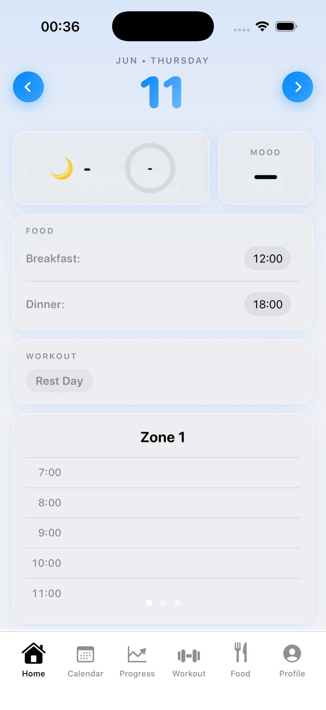
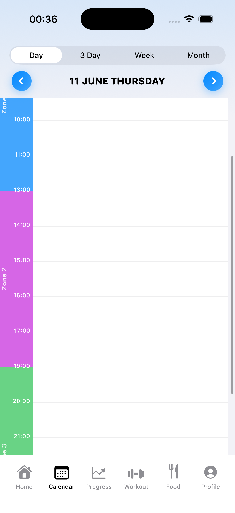
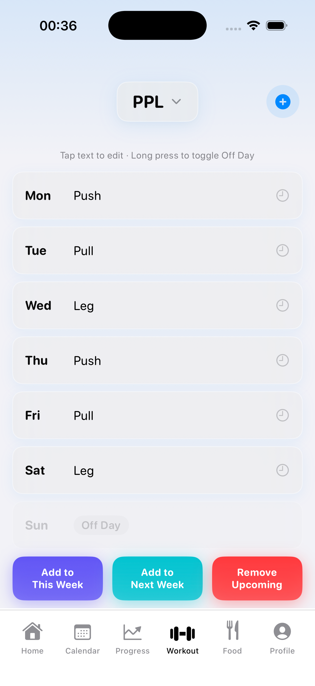
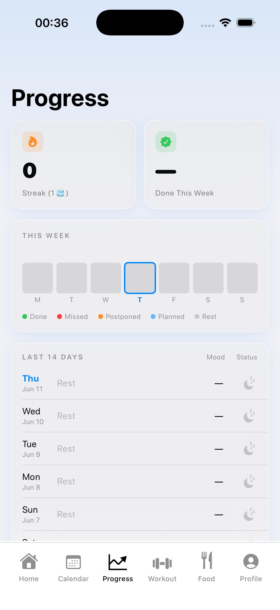
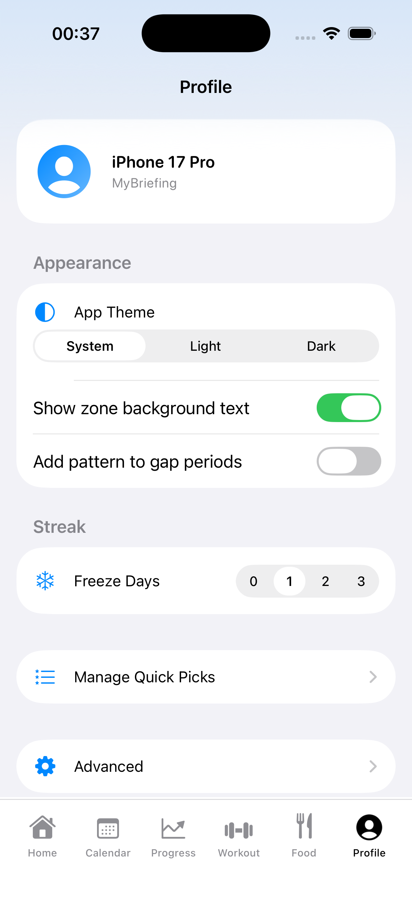
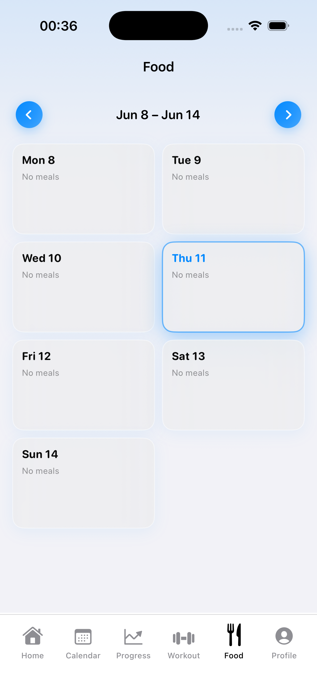

# MyBriefing

> Your daily health and productivity command center — built natively for iPhone.

MyBriefing brings together sleep, mood, workouts, nutrition, and your calendar into a single focused dashboard. Start every day with a clear picture of what matters.

---

## Screenshots

| Home | Calendar | Workout | Progress |
|------|----------|---------|----------|
|  |  |  |  |

| Widget | Zones | Settings | Food |
|--------|-------|----------|------|
|  |  |  |  |

---

## Features

### 🏠 Daily Briefing (Home)
- Sleep duration + quality score pulled automatically from HealthKit
- Mood logging with a 1–10 slider and emoji feedback
- Breakfast & dinner tracking with optional time-picker
- Workout card with ✓ Done / ✗ Missed / → Postpone status buttons
- Swipe left/right to browse any past or future day

### 📅 Calendar
- **Day view** — hourly timeline with event blocks; long-press to move or resize
- **3-Day view** — side-by-side comparison across three days
- **Week view** — Weekly Blueprint with 7 minimalist day cards (workout, meals, status) + insights (workout completion rate, average mood)
- **Month view** — Consistency heatmap + monthly overview stats
- Create events with a single long-press on any time slot
- Full EventKit sync — edits reflect instantly in Apple Calendar

### 💪 Workout
- Split-based schedule (e.g. Push / Pull / Legs / Rest)
- Per-day label override
- Planned time picker that syncs to Calendar
- Streak and completion tracking

### 🥗 Food & Nutrition
- Quick-pick meal templates
- Breakfast and dinner logging with custom times
- Bidirectional Calendar sync (meal events ↔ app entries)

### 📊 Progress
- Multi-week workout completion overview
- Mood trend chart
- Sleep quality history

### ⚙️ Zones
- Define up to 3 daily focus zones (e.g. Morning / Afternoon / Evening)
- Custom start/end hours and zone names
- Zones appear as watermarks in the daily timeline and power the widget

### 🔲 Home Screen Widget
- `systemLarge` widget showing Sleep, Mood, Workout, and Food at a glance
- Live zone timeline with hour-by-hour calendar events
- Interactive pagination buttons to scroll between zones
- Workout status dot (green/red/orange/blue) for instant read
- Tapping the widget deep-links to the app's Home tab
- Refreshes every 15 minutes and on every app foreground

---

## Tech Stack

| Layer | Details |
|-------|---------|
| UI | SwiftUI (iOS 17+) |
| Health data | HealthKit — sleep stages, duration, quality score |
| Calendar | EventKit / EventKitUI — full read/write access |
| Storage | `UserDefaults` (local) + iCloud / CloudKit (sync) |
| Widget | WidgetKit — `StaticConfiguration`, `AppIntent` interactive buttons |
| Data sharing | App Groups (`group.com.Ygujer.MyBriefing.mybriefing`) |
| Architecture | MVVM — `ObservableObject` managers, `@EnvironmentObject` injection |

---

## Requirements

- **iOS 17.0+**
- **Xcode 15+**
- Physical device recommended (HealthKit unavailable in Simulator)
- Calendar and Health permissions required at first launch

---

## Getting Started

```bash
# 1. Clone the repo
git clone https://github.com/YOUR_USERNAME/MyBriefing.git
cd MyBriefing

# 2. Open in Xcode
open MyBriefing.xcodeproj

# 3. Select your development team
#    Xcode → MyBriefing target → Signing & Capabilities → Team

# 4. Run on a real device (HealthKit requires physical hardware)
```

> **App Groups**: Both the main app target and `MyBriefingWidgetExtension` must share the App Group `group.com.Ygujer.MyBriefing.mybriefing`. This is already configured in the entitlements files — you just need to add it to your provisioning profile in the Apple Developer portal if building under a different team.

---

## Project Structure

```
MyBriefing/
├── MyBriefing/
│   ├── Features/
│   │   ├── Home/          # HomeView + SleepDetailsSheet + NoteSheet
│   │   ├── Calendar/      # CalendarTabView (Day / 3-Day / Week / Month)
│   │   ├── Workout/       # WorkoutTabView
│   │   ├── Food/          # FoodTabView
│   │   ├── Progress/      # ProgressTabView
│   │   └── Profile/       # ProfileTabView + SettingsTabView
│   ├── Core/
│   │   ├── Managers/      # CloudKitManager, ZoneSettingsManager
│   │   ├── Services/      # LocalDayDataService, LocalWorkoutService, NutritionService
│   │   ├── WidgetSharedData.swift   # Codable models shared with widget
│   │   └── WidgetDataWriter.swift   # Writes snapshot to App Group container
│   └── Shared/
│       └── Components/    # EventEditViewController, StripedBackground
│
├── MyBriefingWidget/
│   └── MyBriefingWidget.swift  # Widget provider, views, AppIntents
│
├── HealthManager.swift    # HealthKit sleep fetch + score computation
├── CalendarManager.swift  # EventKit CRUD + bidirectional sync
├── WorkoutManager.swift   # Split schedule, status, label management
└── DayDataManager.swift   # Per-day data load/save (mood, meals, notes)
```

---

## License

MIT License — see [LICENSE](LICENSE) for details.

---

<p align="center">Built with SwiftUI · HealthKit · EventKit · WidgetKit</p>
